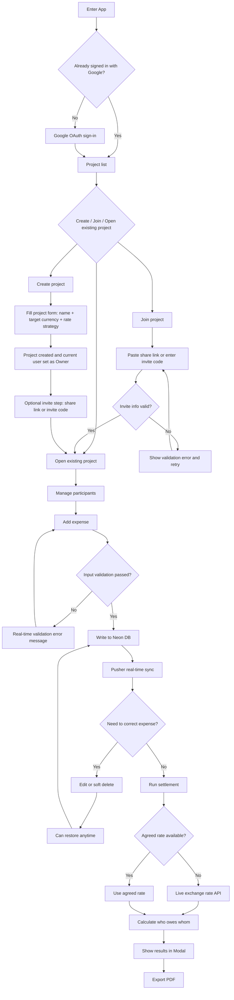

# FairShare PRD (README Baseline Aligned Version)

## 1. Document Purpose

- This document defines FairShare product specifications, **with `README.md` as the baseline**.
- This document also consolidates the currently confirmed productization directions (Google Auth, Pusher, PDF export, bilingual support).

## 2. Project Background and Goals

- Target use case: expense splitting for company team lunches.
- Core value: enable teams to quickly record expenses in multi-currency scenarios and generate an actionable settlement plan (who pays whom).

## 3. Scope Definition

### 3.1 In Scope (v1)

- Project creation and switching (multi-project isolation).
- Join project via share link or invite code.
- Google sign-in.
- Participant add/remove (including removal validation constraints).
- Expense create, list, edit, soft delete, restore.
- Four supported currencies: `USD / TWD / JPY / EUR`.
- Project target settlement currency setting (Target Currency).
- Exchange conversion (agreed rate first; otherwise live rate).
- Settlement result shown in Modal.
- PDF export.
- Real-time sync (Pusher).
- Permission model (Owner / Editor / Viewer; implemented with CASL).
- Automatic locale detection (browser environment, `zh-TW / en`).

### 3.2 Out of Scope (Future)

- Notification system (in-app or push).
- Unequal split methods (ratio, percentage, custom amount).
- Expense splitting for unauthenticated users.

## 4. README Baseline Alignment Checklist

| README Core Requirement                                      | Spec Status                                                    |
| ------------------------------------------------------------ | -------------------------------------------------------------- |
| Create Project / Switch Context / Isolation                  | Aligned, data isolated by `project_id`                         |
| Manage People + remove validation                            | Aligned, participants with existing expenses cannot be removed |
| Add Expense (`payer/amount/currency/description/date/split`) | Aligned                                                        |
| Supported Currencies: USD, TWD, JPY, EUR                     | Aligned (fixed four currencies)                                |
| Expense List + correction flow                               | Aligned (edit/soft delete/restore)                             |
| Target Currency + Calculate + who owes whom                  | Aligned                                                        |
| Result Display in Dialog/Modal                               | Aligned                                                        |
| Exchange Rate API                                            | Aligned (`https://open.er-api.com/v6/latest/TWD`)              |

## 5. Roles and Permissions

### 5.1 Role Layering (both are required)

- **App-level role (Account Role)**: the user's global identity across the product, stored in `app_user.app_role`.
- **Project-level role (Project Role)**: the user's membership role inside one project, stored in `project_member.role`.
- They are separate dimensions and **must not override each other**. The same user can be global `EDITOR` and project `OWNER` at the same time.

### 5.2 App-level responsibilities

| Action                        | Owner                               | Editor                              | Viewer                              |
| ----------------------------- | ----------------------------------- | ----------------------------------- | ----------------------------------- |
| Sign in                       | Yes                                 | Yes                                 | Yes                                 |
| Access own profile (`viewer`) | Yes                                 | Yes                                 | Yes                                 |
| Create project                | Yes                                 | Yes                                 | No                                  |
| Access project data           | Requires membership in that project | Requires membership in that project | Requires membership in that project |

### 5.3 Project-level responsibilities

| Action                                                         | Owner   | Editor  | Viewer  |
| -------------------------------------------------------------- | ------- | ------- | ------- |
| View project/expenses/settlement                               | Yes     | Yes     | Yes     |
| Create project (checked at app level)                          | See 5.2 | See 5.2 | See 5.2 |
| Manage project settings (name, target currency, rate strategy) | Yes     | Yes     | No      |
| Manage participants                                            | Yes     | Yes     | No      |
| Create/edit expenses                                           | Yes     | Yes     | No      |
| Soft delete/restore expenses                                   | Yes     | Yes     | No      |
| Trigger settlement                                             | Yes     | Yes     | Yes     |
| Export PDF                                                     | Yes     | Yes     | Yes     |
| Manage role permissions                                        | Yes     | No      | No      |

### 5.4 Permission evaluation order (implementation contract)

1. Unauthenticated users: deny all protected operations.
2. App-level check: evaluate global capabilities (for example, create project).
3. Project-level check: for all project-scoped operations, first verify membership, then evaluate project role permissions.
4. UI semantics: `accountRole` and `viewerRole` may both be shown to avoid user confusion.

## 6. User Story Flow

## 7. Functional Requirements

### FR-1 Authentication and Sign-in

- Use Google OAuth sign-in.
- No company-domain restriction.
- Unauthenticated users cannot access project data pages.

### FR-2 Project Management

- Users can create multiple projects.
- Users can join via share link or invite code.
- Users can switch between projects.
- Each project's data must be isolated without cross-project contamination.
- After successful join via share link or invite code, show a success message (including project name), and the project must immediately appear in the list.
- If join fails (invalid/expired/unauthorized), show a clear, understandable error with retry capability. The UI must not remain in a no-feedback state.

### FR-2b Join Feedback

- Success state:
  - Show success toast/banner: `Joined project: {projectName}` (zh-TW: `已加入專案：{projectName}`).
  - Recommended duration: 2-3 seconds, and dismissible.
  - After success, route back to project list and make the newly joined project visible in the first viewport (can be achieved by sorting by updated time).
- Already-member state:
  - Show info toast/banner: `You are already in this project.` (zh-TW: `你已在此專案中。`).
  - This is not an error and must not block subsequent operations.
- Failure state:
  - Show error toast/banner: `Invalid or expired invite code.` (zh-TW: `邀請碼無效或已過期。`).
  - Keep input value and provide `Retry` or re-entry path.

### FR-3 Participant Management

- Participants can be added to the current project.
- When removing a participant, if the participant appears in any non-deleted expense, removal must be blocked with a friendly message.

### FR-4 Expense Management

- Fields: `payerId`, `amount`, `currency`, `description?`, `occurredAt`, `splitMode`, `splits`.
- `payerId` must exist in the current project participant list.
- `amount` must be a positive number.
- `currency` must be one of `USD/TWD/JPY/EUR`.
- `occurredAt` must be a valid date-time.
- `splitMode` must be one of `EQUAL / EXACT / SHARES`.
- `splits` validation:
  - `EQUAL`: at least one participant selected.
  - `EXACT`: every selected participant has amount > 0, and sum equals total amount.
  - `SHARES`: every selected participant has shares > 0.
- Expenses must be displayed in the current project's list.

### FR-5 Mistake Handling

- Support expense editing.
- Support soft delete (retain data, no hard delete).
- Support restoring soft-deleted expenses (no time limit).

### FR-6 Exchange Rates and Settlement

- Each project can set `targetCurrency`.
- Rate strategy rule 1: if agreed rates exist, use agreed rates first.
- Rate strategy rule 2: if no agreed rates exist, call live rate API: `https://open.er-api.com/v6/latest/TWD`.
- Calculation output must provide readability-first payment instructions (A pays B X currency).

### FR-7 Result Presentation

- Use Dialog/Modal to display settlement results.
- Show target currency, instruction list, and calculation timestamp.

### FR-8 Real-time Sync

- All expense changes, restores, and project setting updates must be broadcast via Pusher.
- Other online members should see updates within reasonable delay (target < 2 seconds).

### FR-9 PDF Export

- Settlement results can be exported as PDF.
- PDF field 1: project name.
- PDF field 2: export timestamp.
- PDF field 3: target currency.
- PDF field 4: rate snapshot used (source and value).
- PDF field 5: settlement instruction list.
- PDF field 6: expense details (optional soft-delete indicator).

### FR-10 Localization

- Default locale auto-detects browser language: `zh-TW` or `en`.
- If locale is not in supported list, fallback to `en`.

## 8. Acceptance Criteria

### AC-1 README Baseline

- Four currencies are selectable (USD/TWD/JPY/EUR).
- Multiple projects can be created, and data remains correctly isolated when switching.
- Settlement can be triggered in UI and displayed in Modal.

### AC-1b Join Entry

- Users can join projects via share link or invite code.
- Invalid link/code must show clear errors and allow retry.
- On successful join, success message must be shown and project list must immediately reflect the newly joined project.
- If user is already a member, show an info message instead of a generic error.

### AC-2 Participant Removal Validation

- If participant already has expenses, remove action must fail with reason.
- If participant has no expenses, removal succeeds.

### AC-3 Expense Correction

- Expense can be edited and updates must immediately appear in the list.
- Expense can be soft deleted without compromising data integrity.
- Soft-deleted expense can be restored at any time.

### AC-4 Rate Strategy

- Without agreed rates, system can fetch live rates and complete settlement.
- With agreed rates configured, settlement must not be overridden by live rates.

### AC-5 Permission Control

- Viewer cannot create, edit, or delete expenses.
- Editor can manage participants and expenses, but cannot manage roles.
- Owner can manage roles and all resources.

### AC-6 Real-time Sync

- After user A creates/edits expenses, user B's screen auto-updates.

### AC-7 PDF Export

- PDF can be downloaded, includes required fields, and values match UI.

### AC-8 Localization

- When browser locale is `zh-TW`, UI defaults to Chinese.
- When browser locale is `en-*`, UI defaults to English.

## 9. Technical Recommendations (Non-mandatory)

- Frontend: React + TypeScript.
- Validation: Zod or equivalent schema validation tooling.
- Authentication: Google OAuth (implementation options include Auth.js/NextAuth or Firebase Auth).
- Realtime: Pusher Channels.
- DB: Neon PostgreSQL.
- Authorization: CASL.
- PDF: react-pdf or jsPDF.

## 10. Risks and Notes

- Exchange rate API is a third-party dependency; must provide failure fallback (retry/error hint).
- Settlement should persist rate snapshot at calculation time to avoid disputes caused by later rate changes.
- Soft-deleted data must be clearly marked in UI to avoid user misunderstanding as "data loss."

## 11. Design Spec Supplement (PWA + Bento Grid)

- Added design token and precise Figma frame description doc: `docs/DESIGN_TOKENS_PWA_BENTO_GRID.md`.
- This doc includes:
  - PWA-oriented design principles (mobile-first, install prompt, sync status).
  - Bento Grid style design tokens (color, typography, spacing, radius, shadow, motion).
  - Frame-by-frame specs aligned with this PRD functional scope (Auth, Project, Participants, Expenses, Settlement, Realtime, PDF, i18n, Desktop).
  - Image-generation prompts for rapid visual validation.
