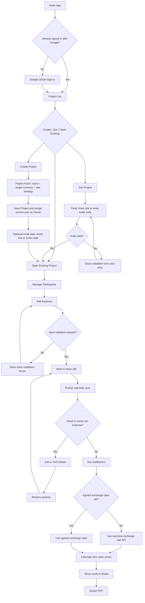

# FairShare PRD (README Baseline Aligned Version)

## 1. Document Purpose

- This document defines the FairShare product specification, using `README.md` as the baseline.
- This document also integrates the currently confirmed product-oriented directions (Google Auth, Pusher, PDF export, and bilingual support).

## 2. Project Context and Goals

- Target use case: company team lunch cost splitting.
- Core value: enable teams to quickly record expenses across multiple currencies and get an actionable settlement plan (who should pay whom).

## 3. Scope Definition

### 3.1 In Scope (v1)

- Create and switch projects (multi-project isolation).
- Join projects via share link or invite code.
- Google sign-in.
- Add/remove participants (including removal validation).
- Add, list, edit, soft delete, and restore expenses.
- Support four currencies: `USD / TWD / JPY / EUR`.
- Project settlement currency setting (Target Currency).
- Exchange-rate conversion (agreed rates first, otherwise real-time rates).
- Display settlement results in a modal.
- PDF export.
- Real-time sync (Pusher).
- Permission model (Owner / Editor / Viewer; implemented with CASL).
- Automatic locale detection (browser environment, `zh-TW / en`).

### 3.2 Out of Scope (Future)

- Notification system (in-app or push).
- Uneven split logic (ratio, percentage, fixed amount).
- Unauthenticated participants in splitting.

## 4. README Baseline Alignment Checklist

| README Requirement                              | Spec Status                                                   |
| ----------------------------------------------- | ------------------------------------------------------------- |
| Create Project / Switch Context / Isolation     | Aligned, data isolated by `project_id`                        |
| Manage People + remove validation               | Aligned, participant with recorded expenses cannot be removed |
| Add Expense (payer/amount/currency/description) | Aligned                                                       |
| Supported Currencies: USD, TWD, JPY, EUR        | Aligned (fixed four-currency support)                         |
| Expense List + correction flow                  | Aligned (edit/soft delete/restore)                            |
| Target Currency + Calculate + who owes whom     | Aligned                                                       |
| Result Display in Dialog/Modal                  | Aligned                                                       |
| Exchange Rate API                               | Aligned (`https://open.er-api.com/v6/latest/TWD`)             |

## 5. Roles and Permissions

| Action                                                             | Owner | Editor | Viewer |
| ------------------------------------------------------------------ | ----- | ------ | ------ |
| View project/expenses/settlement                                   | Yes   | Yes    | Yes    |
| Create project                                                     | Yes   | Yes    | No     |
| Manage project settings (name, settlement currency, rate strategy) | Yes   | Yes    | No     |
| Manage participants                                                | Yes   | Yes    | No     |
| Add/edit expenses                                                  | Yes   | Yes    | No     |
| Soft delete/restore expenses                                       | Yes   | Yes    | No     |
| Trigger settlement                                                 | Yes   | Yes    | Yes    |
| Export PDF                                                         | Yes   | Yes    | Yes    |
| Manage role permissions                                            | Yes   | No     | No     |

## 6. User Flow (User Story Flow)

## 7. Functional Requirements

### FR-1 Authentication and Sign-in

- Sign in with Google OAuth.
- No company-domain restriction.
- Unauthenticated users cannot access project data pages.

### FR-2 Project Management

- Users can create multiple projects.
- Users can join projects via share link or invite code.
- Users can switch between projects.
- Project data must be fully isolated with no cross-project pollution.

### FR-3 Participant Management

- Users can add participants to the current project.
- When attempting to remove a participant, if that participant appears in any non-deleted expense, removal must be blocked with a friendly message.

### FR-4 Expense Management

- Fields: `payerId`, `amount`, `currency`, `description?`.
- `payerId` must exist in the current project's participant list.
- `amount` must be a positive number.
- `currency` must be one of `USD/TWD/JPY/EUR`.
- Expenses must be displayed in the current project's expense list.

### FR-5 Correction Flow (Mistake Handling)

- Support editing expenses.
- Support soft delete (retain data; no hard delete).
- Support restoring soft-deleted expenses (no time limit).

### FR-6 Exchange Rates and Settlement

- Each project can set a `targetCurrency`.
- Rate Strategy Rule 1: if agreed rates exist, they take priority.
- Rate Strategy Rule 2: if no agreed rates exist, call the real-time rate API: `https://open.er-api.com/v6/latest/TWD`.
- The settlement result must generate readability-first payment instructions (A pays B X currency).

### FR-7 Result Display

- Show settlement results in a Dialog/Modal.
- Display target currency, transaction instructions, and calculation timestamp.

### FR-8 Real-time Sync

- All expense changes, restorations, and project setting updates must be broadcast through Pusher.
- Other online members should see updates within reasonable latency (target < 2 seconds).

### FR-9 PDF Export

- Settlement results can be exported as PDF.
- PDF Field 1: project name.
- PDF Field 2: export timestamp.
- PDF Field 3: target currency.
- PDF Field 4: exchange-rate snapshot (source and values).
- PDF Field 5: settlement transaction list.
- PDF Field 6: expense details (with optional soft-delete markers).

### FR-10 Localization

- Default locale should auto-switch to `zh-TW` or `en` based on browser language.
- If the locale is unsupported, fallback to `en`.

## 8. Acceptance Criteria

### AC-1 README Baseline

- Four currencies (USD/TWD/JPY/EUR) are selectable.
- Users can create multiple projects and data remains correctly isolated when switching.
- Users can trigger settlement in UI and see results in a Modal.

### AC-1b Join Project Entry

- Users can join a project via share link or invite code.
- Invalid link/code must show a clear error and allow retry.

### AC-2 Participant Removal Validation

- If a participant already has recorded expenses, removal must fail with an explanatory message.
- If a participant has no expenses, removal succeeds.

### AC-3 Expense Corrections

- Expenses can be edited and changes are reflected in the list immediately.
- Expenses can be soft deleted without data integrity issues.
- Soft-deleted expenses can be restored at any time.

### AC-4 Exchange-rate Strategy

- Without agreed rates, the system can fetch real-time rates and complete settlement.
- With agreed rates configured, settlement must not be overwritten by real-time rates.

### AC-5 Access Control

- Viewer cannot add, edit, or delete expenses.
- Editor can manage participants and expenses but cannot manage roles.
- Owner can manage roles and all resources.

### AC-6 Real-time Sync

- When User A adds or edits an expense, User B's view updates automatically.

### AC-7 PDF Export

- PDF can be downloaded, includes required fields, and values match UI data.

### AC-8 Localization

- When browser locale is `zh-TW`, the interface defaults to Chinese.
- When browser locale is `en-*`, the interface defaults to English.

## 9. Implementation Suggestions (Non-mandatory)

- Frontend: React + TypeScript.
- Validation: Zod or an equivalent schema validation tool.
- Authentication: Google OAuth (Auth.js/NextAuth or Firebase Auth at implementation layer).
- Real-time: Pusher Channels.
- DB: Neon PostgreSQL.
- Permissions: CASL.
- PDF: react-pdf or jsPDF.

## 10. Risks and Notes

- Exchange-rate API is a third-party service; fallback handling is required (retry/error messaging).
- Settlement outputs should preserve the exchange-rate snapshot used at calculation time to prevent later disputes.
- Soft-deleted data should be clearly marked in UI to avoid user confusion about data loss.
